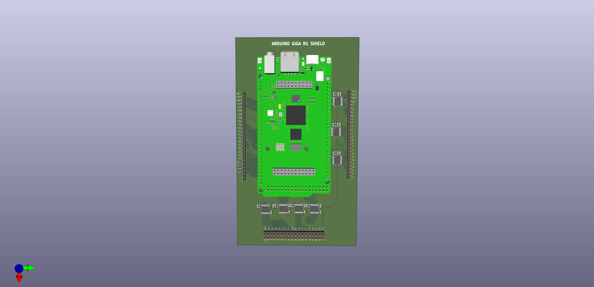
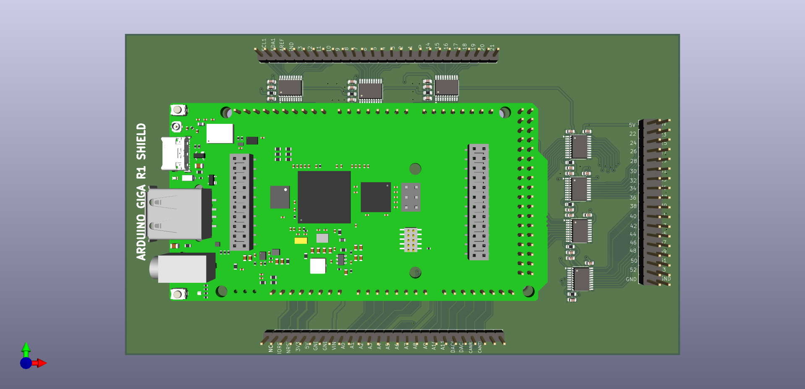
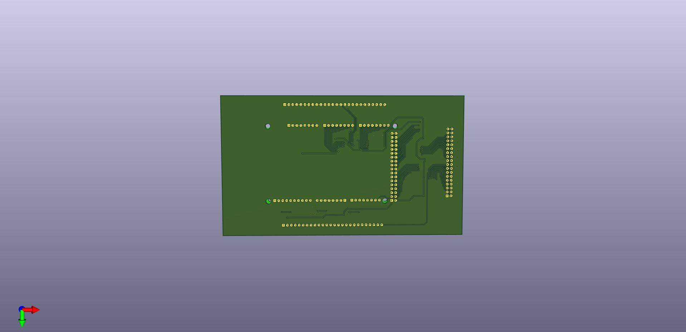

# RetroShield Level Shifter PCB — Arduino Giga R1 Shield

KiCad design files for a bidirectional 3.3V-to-5V level converter shield that sits between an [Arduino Giga R1 WiFi](https://store.arduino.cc/products/giga-r1-wifi) and a [RetroShield Z80](https://www.tindie.com/products/8bitforce/retroshield-for-arduino-mega-z80/). The shield translates all bus signals between the Giga's 3.3V logic and the RetroShield's 5V logic.

<p align="center">
  
</p>

## Design Overview

The shield uses nine **TXB0108PW** 8-bit bidirectional level converter ICs, providing 72 channels of voltage translation. The TXB0108 uses automatic direction sensing — it detects which side is driving each signal and translates accordingly.

**Board specifications:**
- **Dimensions:** 155mm x 90mm (matches Arduino Giga R1 footprint)
- **Layers:** 2-layer PCB
- **Level shifter ICs:** 9x TXB0108PW (TSSOP-20)
- **Signals translated:** 72 channels covering data bus, address bus, and control signals
- **Version:** V0.1

### Signal Groups

| Signal Group | Pins | Channels | Direction |
|-------------|------|----------|-----------|
| Data bus D0–D7 | D42–D49 | 8 | Bidirectional |
| Address bus A0–A7 | D22–D29 | 8 | Z80 → Arduino (input) |
| Address bus A8–A15 | D30–D37 | 8 | Z80 → Arduino (input) |
| Control (MREQ, WR, IORQ, RD) | D39–D41, D53 | 4 | Z80 → Arduino (input) |
| Control (RESET, INT, NMI, CLK) | D38, D50–D52 | 4 | Arduino → Z80 (output) |
| Remaining GPIO | Various | 40 | Bidirectional |

### Known Limitations

The TXB0108's auto-direction sensing fails for some Z80 bus signals in practice:

- **IORQ_N** (pin 39) — stuck HIGH; never toggles through the converter
- **RD_N** (pin 53) — stuck HIGH; never toggles through the converter
- **Data bus Z80→Arduino** — invisible during I/O write cycles

These failures are worked around in firmware via shadow register tracking. See the [companion firmware project](https://github.com/ajokela/retroshield-z80-cpm-giga) for details.

## Repository Contents

```
kicad/                  KiCad 8 source files
  ├── AlexJ_bz_ArduinoGigaShield.kicad_pro    Project file
  ├── AlexJ_bz_ArduinoGigaShield.kicad_sch    Schematic
  ├── AlexJ_bz_ArduinoGigaShield.kicad_pcb    PCB layout
  └── AlexJ_bz_ArduinoGigaShield.kicad_prl    Project preferences

gerber/                 Production-ready Gerber files
  ├── *-F_Cu.gbr           Front copper
  ├── *-B_Cu.gbr           Back copper
  ├── *-F_Mask.gbr         Front solder mask
  ├── *-B_Mask.gbr         Back solder mask
  ├── *-F_Silkscreen.gbr   Front silkscreen
  ├── *-B_Silkscreen.gbr   Back silkscreen
  ├── *-F_Paste.gbr        Front paste (for stencil)
  ├── *-B_Paste.gbr        Back paste
  ├── *-Edge_Cuts.gbr      Board outline
  ├── *-PTH.drl            Plated through-hole drill
  ├── *-NPTH.drl           Non-plated through-hole drill
  └── *-job.gbrjob         Gerber job file

bom/                    Bill of Materials
  ├── AlexJ_bz_ArduinoGigaShield.csv     CSV format
  └── AlexJ_bz_ArduinoGigaShield.xlsx    Excel format

cpl/                    Component Placement
  └── AlexJ_bz_ArduinoGigaShield-all-pos.csv   Pick & place positions

schematic/              Schematic PDF
  └── AlexJ_bz_ArduinoGigaShield.pdf

images/                 3D renders
  ├── AlexJ_bz_ArduinoGigaShield_TOP.jpg       Top view
  ├── AlexJ_bz_ArduinoGigaShield_TOP.png       Top view (PNG)
  ├── AlexJ_bz_ArduinoGigaShield_BTM.jpg       Bottom view
  └── AlexJ_bz_ArduinoGigaShield.png           Perspective view
```

## Bill of Materials

| Reference | Qty | Value | Part Number | Package |
|-----------|-----|-------|-------------|---------|
| U1–U9 | 9 | TXB0108PW | TXB0108PWR | TSSOP-20 |
| C1–C27 | 27 | 0.1 uF | CC0603KRX7R9BB104 | 0603 |
| R1–R9 | 9 | 10K | RC0603FR-0710KL | 0603 |

Each TXB0108 has a 0.1 uF decoupling capacitor on both VCCA (3.3V) and VCCB (5V) power pins. The 10K pull-up resistors tie the OE (Output Enable) pins to 3.3V.

## Manufacturing

The Gerber files in `gerber/` can be uploaded directly to any PCB fabrication service:

- [PCBWay](https://www.pcbway.com/)
- [JLCPCB](https://jlcpcb.com/)
- [OSH Park](https://oshpark.com/)

For SMD assembly, provide the BOM (`bom/`) and component placement file (`cpl/`) to the fab house.

### Recommended PCB Specs

| Parameter | Value |
|-----------|-------|
| Layers | 2 |
| Board thickness | 1.6 mm |
| Copper weight | 1 oz |
| Surface finish | HASL or ENIG |
| Solder mask | Red (or your preference) |
| Silkscreen | White |

## Assembly Notes

1. **SMD components first** — solder the TXB0108PW ICs, decoupling capacitors, and pull-up resistors
2. **Pin headers last** — solder the through-hole pin headers (female on bottom for the Giga, male on top for the RetroShield)
3. **Power jumper** — a jumper wire connects the Giga's 3.3V output to the shield's VCCA rail (visible in assembly photos)
4. **Orientation** — the shield silkscreen is labeled "ARDUINO GIGA R1 SHIELD V0.1" with pin numbers matching the Giga's header layout

## Photos

<p align="center">
  
</p>

<p align="center">
  
</p>

## Related Projects

- [retroshield-z80-cpm-giga](https://github.com/ajokela/retroshield-z80-cpm-giga) — Arduino Giga R1 firmware for CP/M 2.2 on the RetroShield Z80
- [retroshield-sector-server](https://github.com/ajokela/retroshield-sector-server) — Rust TCP server for WiFi-based CP/M disk I/O

## Blog Posts

This project is documented in a three-part series on [tinycomputers.io](https://tinycomputers.io):

1. [My Experience Using Fiverr for Custom PCB Design: A $468 Arduino Giga Shield](https://tinycomputers.io/posts/fiverr-pcb-design-arduino-giga-shield/)
2. [Porting CP/M to the Arduino Giga R1: When Level Converters Fight Back](https://tinycomputers.io/posts/cpm-on-arduino-giga-r1-wifi/)
3. [Playing Zork on a Real Z80: From CP/M Boot to the Great Underground Empire](https://tinycomputers.io/posts/zork-on-retroshield-z80-arduino-giga/)

## License

This work is licensed under the [Creative Commons Attribution-ShareAlike 4.0 International License](https://creativecommons.org/licenses/by-sa/4.0/) (CC BY-SA 4.0). See [LICENSE](LICENSE).

You are free to share and adapt this design, including for commercial purposes, as long as you give appropriate credit and distribute derivative works under the same license.

## Author

Alex Jokela — [tinycomputers.io](https://tinycomputers.io)

PCB design by Elijah (ekeziah) via Fiverr. Manufacturing sponsored by [PCBWay](https://www.pcbway.com/).
